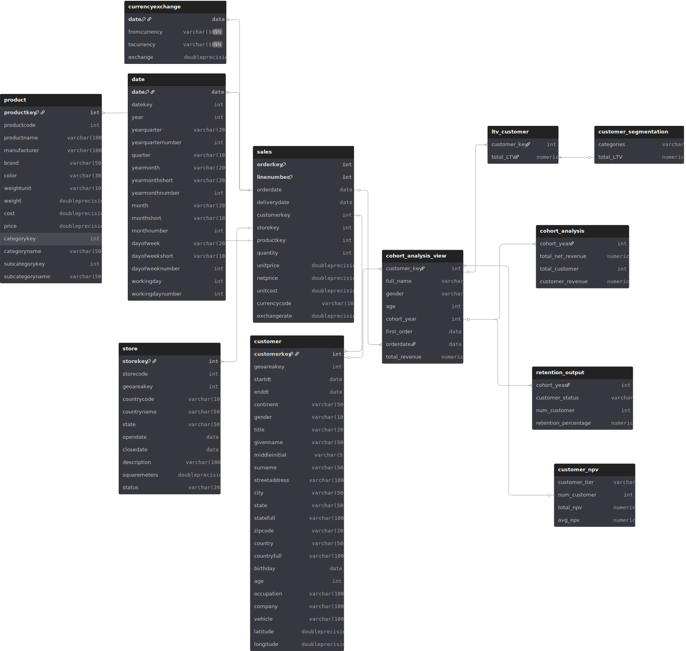

# INTERMEDIATE SQL - SALES ANALYSIS

## Overview
This project is based on the Contoso database of Luke Barousse that is uploaded and available on Github. As this is a self taught Intermediate SQL course under that focused on analyzing the different sales aspect of an e-commerce business called contoso. Although this project was learned and followed Luke Barousse's teaching the execution of the queries followed some different approach to solve the question rather than blindly follow the intstrustion.

## Business Questions
With this database I tend to find out the following question 
 1. **Customer Segmentation**: How to divied the customer into different segment based on their average life-time value(LTV)? 
 2. **Cohort Analysis**: How much customer revenue generated by different customer cohort?
 3. **Customer Retention**: Which customers haven't purchased recently (for last 6 months)?

## Analysis Approach

### Entity-Relationship Diagram (ERD)

This ERD diagram shows the analysis of the contoso100k database that is consited of different tables. However, for the sales analysis I have only used the sales and customer table. And from these I have created a cohort_analysis_view for smoother and faster analysis of the problems according to the project.

This ERD shows a clear visual explanation of the analysis of the data and its end results. 

The diagram is generated from the [ERD_schema](schema/erd%20dbml.sql)

### 1. Customer Segmentation
- Seperated the customer into 3 different segment based on their LTV.
- Afrer the segmentation of the customers, their LTV and average LTV along with the number of customer each segment was tracked for further analysis.

Query: [1_customer_segmentation.sql](/1_customer_segmentation.sql)

**Visualization**

**Key Findings:**
- From this analysis it's prominent that the High value customer segment coveres the major share (65.6%) of the revenue.
- Then the middle segment covering 32.3% of the total LTV.
- And lastly the low value customers which is only around 2.1%
- The most surprising finding was the number of customer in different segments. Especially when it comes to the Low and High Value customer segment.
-Although they share the same amount of customer, the sheer revenue this segment generate, outperfom the other 2 segments combined.

**Business Insights**
- From this finding, it can be theorized that the low-value segment of the customer barely impact the companys revenue generation.
- The company need to come up with re-engagement campaign to attract the low-level customers more. 
- However, the most promising steps would be for the company to find the products that attract the low-value customer segment and then slowly empty the inventory and stop storing those products.
- This way the company can either divert the low-value customers to the Mid or High value segments. And if they can't do that, they can use the resources to focus on the Mid and High Value customer segment.
- This would generate more revenue for the company in the long run.
- To ensure the company retain it's large customer base of the high value customer segment (12,372 customers), the compnay should create VIP membership program and ammenities to the customers from that segment to keep them engaged with the company.
- For the mid value cuastomer segment, the company should create tailored membership path to keep the mid value customer segment content with their product and services.

### 2. Cohort Analysis
- Tracked the revenue and customer count of each yearly cohort 
- Analyzed the customer retention of the compnay at the yearly cohort level

Query: [2_cohort_analysis.sql](/2_cohort_analysis.sql)

**Visualization**

 **Key Findings:** 
- From the bar chart we find that the revnue from earlier cohort have been higher compared to the later cohort along with customer count.
-Especially after 2020 (when covid hit) the revenue and the customer count has dropped significantly and been continuously plummeting
- Although the revenue seems declining through a consistenty the declining of the customer count is quite alarming.

**Business Insights**
-From the key finding it can be tehorized that the customer count and the revenue is degreasing overtime which would need further analysis to figure out the customer LTV.
-This might have potential revnue decline if the proper reasoning of the customer decline isn't addressed acqurately.

### 3. Customer Retention
- Tracked the customer retention by cohort year 
- Analyzed the last purchased pattern of the customers
-Finding the retention and churned rate of the customers.

Query: [3_customer_retention_analysis.sql](/Users/nejumbarua/Int_SQL_Project-contoso_100k/3_customer_retention_analysis.sql)

**Visualization**

**Key Findings:**
- The analysis shows that, the customer churned rate for each year is around 90% for each year. 
- The retention rate is consistently within 8-10% and the highest one is on 2022. This implify that the retention issue isn't dependent on only certain year rather the strategic approach of the company.
- The last two cohort (2022-2023) shows high churn rate of customer (especially 2022). Indicating the high probabilty of repetition in the future years.

**Business Insights**
- The compmay should create and provide membership, royalities rewards, amenities or other such marketing strategies to ensure the retention of the customer at the early stage.
- There should be re-engagement campaign to retain the specific customer segment instead of focusing on the overall customers of that cohort. This should be done by analysing the customer segments of a cohort and revenue generqated through them.

## Strategic Recommendations 
1. As the data shows theres a reduction of revenue generation each year along with the customer retention, the company should seriously consider changing their strategy inorder to retain their customers.
2. In order to get fast result, the company should eminently focus on the retention of the customers from the High Value segment. The customer from this segment generates the highest revenue for the company. Analyzing only the top 10 percent customers from the total customers shows the importance of retaining this customer segment. 
Query: 

    The top 10% Premium customers generate over 38% of the total net present value, with an average NPV that is more than 5.5 times higher than Regular customers. Targeting and retaining these customers should be a priority for marketing and customer success teams.
    So the company's focus should be creating campaigns that would retain these high value customers and engage with them.

3. For the long term customer retention and higher growth in the revenue the company should try carry out campaigns to retain the customer from Mid Value Segment and slowly try to divert them to High-value customer segment by providing tailored reward points.
4. As theres little revenue (around only 2%) generates from the low value customer segment,the company should focus on dry out the inventory gradually and try to covert them towards the mid-value customer segment.

## Technical Details
- **Database:** PostgreSQL
- **Analysis Tools** PostgreSQL, dBeaver, VS code, pgAdmin
- **Visualization** ChatGPT
- **ERD Diagram** dbdiagram.io